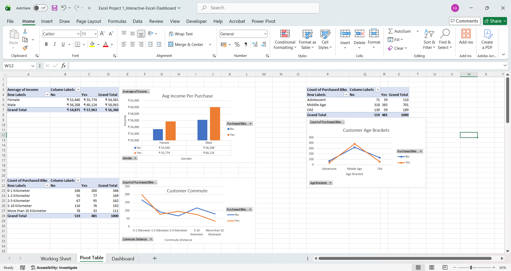
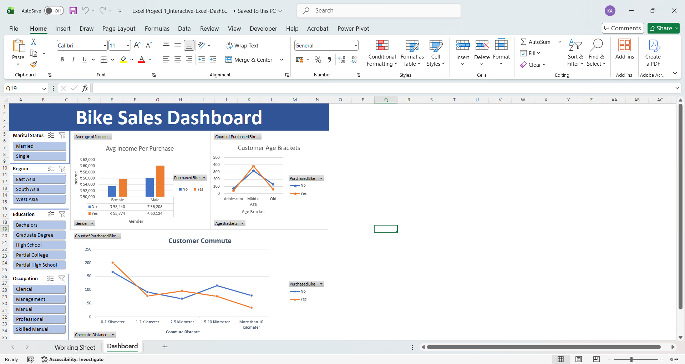
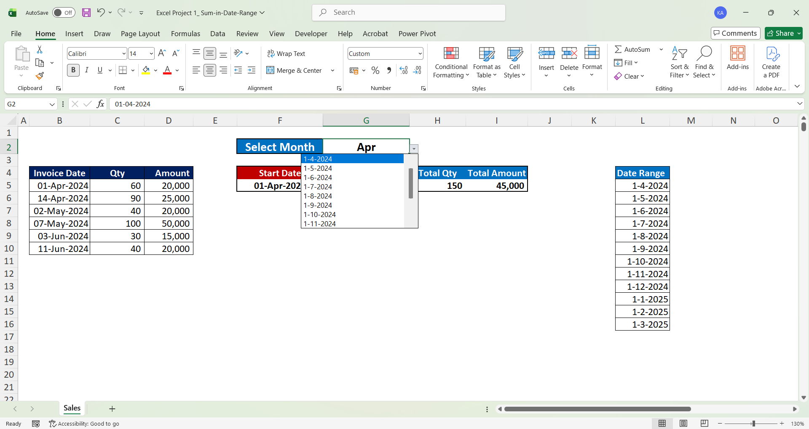
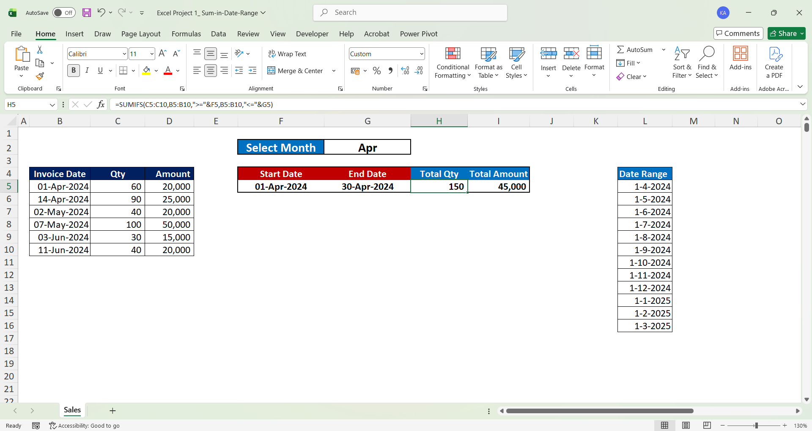
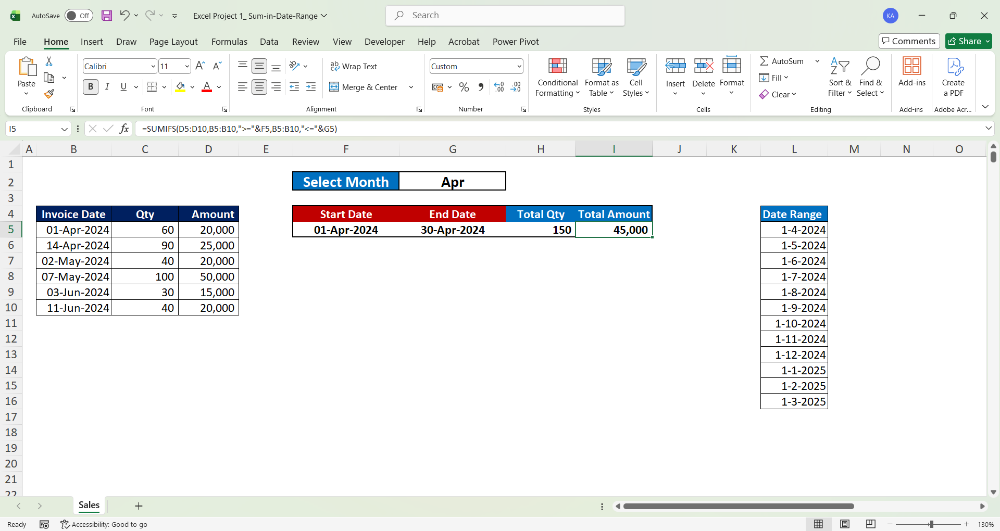
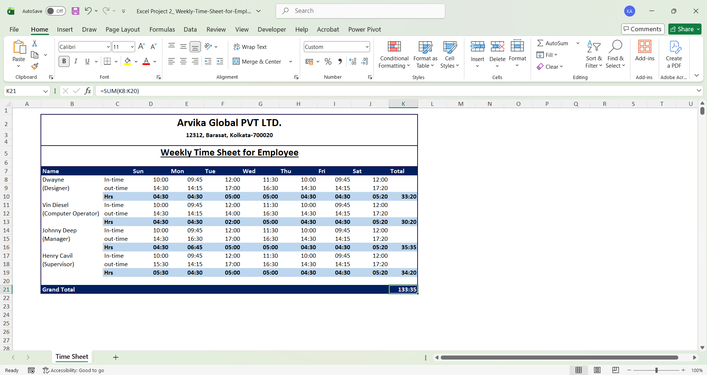

# Microsoft Excel Data Analysis & Automation Portfolio

This repository hosts a curated collection of professional, production-ready Microsoft Excel utility tools built to handle dynamic data evaluation, workspace tracking, and automated process formatting.

---

## 📊 Project 1: Bike Sales Interactive Dashboard (Data Visualization)

### 📌 Project Overview
Built a comprehensive customer demographic dashboard to analyze target consumer attributes—including marital status, income brackets, education levels, and regional commutes—to identify primary drivers behind bicycle purchase behaviors.

### 🛠️ Excel Tools & Techniques Used
- **Data Engineering:** Maintained structured backend datasets (`Working Sheet`) to manage customer profiles seamlessly.
- **Analytical Aggregation:** Constructed multi-layered Pivot Tables to evaluate numerical averages (e.g., consumer income relative to purchasing conversions).
- **Interactive Slicers:** Connected dynamic frontend UI Slicers to filter complex chart layouts simultaneously across regions, education, and age brackets.

### 📷 Workbook Interface & Feature Previews

  
  
  

---

## 📅 Project 2: Sum-in-Date-Range (Data Analysis Tool)

### 📌 Project Overview
Developed an interactive calculation utility designed to crawl transaction ledgers and automatically aggregate quantity and financial sales totals within flexible, user-defined chronological boundaries.

### 🛠️ Formulas & Techniques Used
- **Dynamic Calculation Matrix:** Engineered auto-updating formulas utilizing `SUMIFS` to filter multi-column transaction records on the fly.
- **Data Input Safeguards:** Isolated reference metrics in an auxiliary validation column (`Date Range`) to feed clean, human-error-proof Data Validation drop-down lists.
- **Reporting Interface:** Formatted data grids with custom dark-themed headers and hidden gridlines to present metrics cleanly to stakeholders.

### 📷 Workbook Interface & Feature Previews

  
  
  

  
  

---

## ⏱️ Project 3: Weekly Employee Timesheet (Process Automation)

### 📌 Project Overview
Engineered a scalable, structured workforce tracking template designed to log corporate clock-in/clock-out intervals, manage operational shifts, and automatically output total cumulative tracking summaries.

### 🛠️ Formulas & Techniques Used
- **Time Arithmetic:** Configured calculation blocks using time-formatted metrics to evaluate daily hours, standard shift windows, and total work hours summaries.
- **UI Architecture:** Segmented employee profile blocks (tracking Designer and Computer Operator designations) to maintain a highly organized tabular data structure.
- **Corporate Presentation:** Designed an executive-level reporting banner for "Arvika Global PVT LTD." with localized metadata layouts to eliminate interface confusion for corporate end-users.

### 📷 Workbook Interface & Feature Previews

  
  
  

---

## 📁 Repository Structure
- `/Excel Project 1_Interactive-Excel-Dashboard.xlsx` - Dynamic dashboard utilizing charts, pivot tables, and interactive slicers.
- `/Excel Project 1_ Sum-in-Date-Range.xlsx` - Dynamic data sorting and interval calculation tool.
- `/Excel Project 2_ Weekly-Time-Sheet-for-Employee.xlsx` - Automated workplace hours and payroll summary template.amic data sorting and interval calculation tool.
- `/Excel Project 2_ Weekly-Time-Sheet-for-Employee.xlsx` - Automated workplace hours and payroll summary template.
